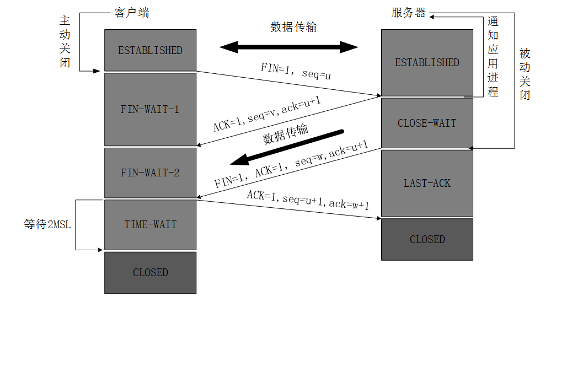
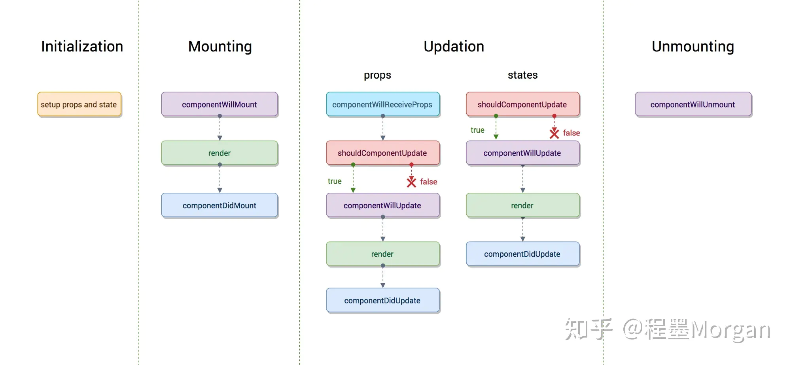

[Author]: #> "wjb"
[CreateTime]: #> "2021.03.17"

# JavaScript


## 1  原始值和引用值类型及区别

[JavaScript 深入了解基本类型和引用类型的值](https://www.runoob.com/w3cnote/javascript-basic-types-and-reference-types.html)

**原始值（简单数据类型）**：存储在栈中的简单数据段，也就是说，它们的值直接存储在变量访问的位置。
6种简单数据类型：undefined、null、boolean、number、string、symbol；可以通过typeof 运算符来判断一个值是否在某种类型的范围内，如果它是原始类型，还可以判断它表示哪种原始类型(除null)。


**引用值（复杂数据类型）**：存储在堆中的对象，放在变量的栈空间中的值是该对象存储在堆中的地址，也就是说，存储在变量处的值是一个指针（内存地址），指向存储对象的堆内存中。
包含：Object、function、array等。


**<font color="#dd0000">区别：</font>**

简单数据类型的值是储存在栈中，当把一个变量传递给另一个变量时，是把一个栈中的东西复制到另一个到栈中，并且这两个变量互不影响，修改其中的变量值时，不会改变另外一个变量的结果。

引用数据类型是把变量标识符和和指向堆内存中该对象的指针（内存地址）存储在栈中，但是把其实际对象存储在堆中，栈中的内存地址指向堆中的实际对象，当把引用对象传递给另一个变量时，复制的其实是指向实际对象的指针（内存地址），此时两者指向的是同一个数据，若通过方法改变其中一个变量的值，则访问另一个变量时，其值也会跟着改变。

------


## 2 判断数据类型

### typeof

优点：能快速检查undefined,string,number,boolean,function类型
缺点：当类型为object,null,array时都会返回object,所以不能区分这三类

### instanceof

用于检测构造函数的 prototype 属性是否出现在某个实例对象的原型链上。

优点：能检测array,function,object类型 
缺点:  检测不了字面量定义的number,boolean,string

### Object.prototype.toString.call()

优点：能准确的判断所有的类型。
缺点：写法过于繁琐

### constructor

- 构造函数的原型中包含属性 `constructor` 指向该构造函数,但是他是不安全的，因为contructor的指向是可以被改变
- null、undefined没有construstor方法，因此constructor不能判断undefined和null。

***


## 3 类数组与数组的区别与转换

- 类数组对象：arguments对象、DOM对象列表;

- 类数组对象也有length属性,可以这种取值: NodeList[0]、NodeList.item(0);

  **<font color="#dd0000">区别：</font>**：数组对象的类型是Array,类数组对象的类型是object，也就是说类数组原型是Object;类数组不具有数组所具有的方法。

  **<font color="#dd0000">转换：</font>**

  1. Array.prototype.slice.call(arrayLike, start);
  2.  Array.from(arrayLike)
  3. 扩展运算符`[...arrayLike]`

***

## 4 数组常见API

[js数组方法整理](https://www.cnblogs.com/zyfeng/p/10541133.html)

***

## 5 call,apply,bind

[JavaScript 中 call()、apply()、bind() 的用法](https://www.runoob.com/w3cnote/js-call-apply-bind.html)

***

## 6 new的原理

1. 创建一个空对象obj（{}）；
2. 将obj的[[prototype]]属性指向构造函数constrc的原型（即obj.[[prototype]] = constrc.prototype）；
3. 将构造函数constrc内部的this绑定到新建的对象obj，执行constrc（也就是跟调用普通函数一样，只是此时函数的this为新创建的对象obj）；
4. 若构造函数没有返回引用类型，则返回该新建的对象obj（默认会添加return this）。否则，返回引用类型的值。


***

## 7 正确判断this

[前端JS必备知识点：如何正确的判断this的指向?](https://blog.csdn.net/weixin_42721322/article/details/106391922)

***

## 8 闭包及其作用

闭包指子函数可以访问外部作用域变量的函数特性，即使在子函数作用域外也可以访问。如果没有闭包那么在处理事件绑定，异步请求时都会变得困难。

由于在Javascript语言中，只有函数内部的子函数才能读取局部变量，因此可以把闭包简单理解成"定义在一个函数内部的函数"。所以，在本质上，闭包就是将函数内部和函数外部连接起来的一座桥梁。

- JS中的所有函数都是闭包
- 闭包一般在子函数本身作用域以外执行，即延伸作用域

闭包可以用在许多地方。它的最大用处有两个：

- 在函数外可以读取函数内部的变量
- 让这些变量的值始终保持在内存中。

坏处：

由于闭包会使得函数中的变量都被保存在内存中，内存消耗很大，所以不能滥用闭包，否则会造成网页的性能问题，在IE中可能导致内存泄露。
解决方法是，在退出函数之前，将不使用的局部变量全部删除。

[彻底理解JS闭包](https://www.cnblogs.com/itjeff/p/10106855.html)
[学习Javascript闭包（Closure）](https://www.ruanyifeng.com/blog/2009/08/learning_javascript_closures.html)
[setTimeout函数之循环和闭包](https://www.jianshu.com/p/e5225ba4a025)

***

## 9 原型


[ 原型基础](https://houdunren.gitee.io/note/js/11%20%E5%8E%9F%E5%9E%8B%E4%B8%8E%E7%BB%A7%E6%89%BF.html#%E5%8E%9F%E5%9E%8B%E5%9F%BA%E7%A1%80)

***


## 10 继承的几种方式

[JavaScript深入之继承的多种方式和优缺点](https://github.com/mqyqingfeng/Blog/issues/16)

### ①原型链继承

1.引用类型的属性被所有实例共享
2.在创建 Child 的实例时，不能向Parent传参

```javascript
function Parent () {
    this.name = 'kevin';
}
Parent.prototype.getName = function () {
    console.log(this.name);
}
function Child () {}
Child.prototype = new Parent();
var child = new Child();
console.log(child.getName()) // kevin
```

### ②借用构造函数（经典继承）

优点：

1.避免了引用类型的属性被所有实例共享

2.可以在 Child 中向 Parent 传参

缺点：

方法都在构造函数中定义，每次创建实例都会创建一遍方法。

```javascript
function Parent () {
    this.names = ['kevin', 'daisy'];
}
function Child () {
    Parent.call(this);
}
var child1 = new Child();
child1.names.push('yayu');
console.log(child1.names); // ["kevin", "daisy", "yayu"]

var child2 = new Child();
console.log(child2.names); // ["kevin", "daisy"]
```

### ③组合继承

优点：融合原型链继承和构造函数的优点，是 JavaScript 中最常用的继承模式。

```javascript
function Parent (name) {
    this.name = name;
    this.colors = ['red', 'blue', 'green'];
}
Parent.prototype.getName = function () {
    console.log(this.name)
}

function Child (name, age) {
    Parent.call(this, name);
    this.age = age;
}

Child.prototype = new Parent();
Child.prototype.constructor = Child;

var child1 = new Child('kevin', '18');
child1.colors.push('black');
console.log(child1.name); // kevin
console.log(child1.age); // 18
console.log(child1.colors); // ["red", "blue", "green", "black"]

var child2 = new Child('daisy', '20');
console.log(child2.name); // daisy
console.log(child2.age); // 20
console.log(child2.colors); // ["red", "blue", "green"]
```

### ④原型式继承

原型式继承继承的基本思想：在 object() 函数内部，先创建一个临时性的构造函数，然后将传入的对象作为这个构造函数的原型，最后返回了这个临时类型的一个新实例。相当于Object.create()

缺点：

包含引用类型值的属性会被所有实例共享，这点跟原型链继承一样。

```javascript
function createObj(o) {
    function F(){}
    F.prototype = o;
    return new F();
}
```

### ⑤寄生式继承

创建一个仅用于封装继承过程的函数，该函数在内部以某种形式来做增强对象，最后返回对象

缺点：跟借用构造函数模式一样，每次创建对象都会创建一遍方法。

```javascript
function createObj (o) {
    var clone = Object.create(o);
    clone.sayName = function () {
        console.log('hi');
    }
    return clone;
}
```

### ⑥寄生组合式继承

这种方式的高效率体现它只调用了一次 Parent 构造函数，并且因此避免了在 Parent.prototype 上面创建不必要的、多余的属性。

与此同时，原型链还能保持不变；因此，还能够正常使用 instanceof 和 isPrototypeOf。

开发人员普遍认为寄生组合式继承是引用类型最理想的继承范式。

```javascript
function object(o) {
    function F() {}
    F.prototype = o;
    return new F();
}

function prototype(child, parent) {
    var prototype = object(parent.prototype);
    prototype.constructor = child;
    child.prototype = prototype;
}

// 当我们使用的时候：
prototype(Child, Parent);
```

***

## 11 深拷贝与浅拷贝

- 浅拷贝：for in,Object.assign,展开语法。
- 深拷贝：

```javascript
JSON.parse(JSON.stringify(obj))
```

```javascript
function copy(object) {
  let obj = object instanceof Array ? [] : {};
  for (const [k, v] of Object.entries(object)) {
    obj[k] = typeof v == "object" ? copy(v) : v;
  }
  return obj;
}
```

***

## 12  防抖和节流

[js 函数的防抖(debounce)与节流(throttle)](https://www.cnblogs.com/cc-freiheit/p/10827372.html)

### 防抖

```javascript
//每次执行都将前一次清掉，只执行最后一次
function debounce(fn, delay) {
    let timer = null
    return function () {
        clearTimeout(timer)
        timer = setTimeout(() => {
            fn.apply(this, arguments)
        }, delay)
    }
}
$('#content').onmousemove = debounce(fn,1000)
```

### 节流

```javascript
//一段时间只执行一次
function throttle(fn, delay) {
    let pre = 0
    return function () {
        let now = Date.now()
        if (now - pre > delay) {
            fn.apply(this, arguments)
            pre = now
        }
    }
}
//计时器方法，如果timeout正在计时，就不执行，这样一段时间只执行一次
function throttle2(fn, delay) {
    let timeout
    return function () {
        if (!timeout) {
            timeout = setTimeout(() => {
                timeout = null
                fn.apply(this, arguments)
            }, delay)
        }
    }
}
$('#content').onmousemove = throttle(fn,1000)
```

***

## <font color='red'>13  作用域和作用域链、执行期上下文</font>

### 词法作用域

词法作用域是指在词法分析阶段就确定了，不会改变。变量的作用域是在定义时决定而不是执行时决定，也就是说词法作用域取决于源码，通过静态分析就能确定，因此词法作用域也叫做静态作用域。

```javascript
let value = 10
function a() {
    console.log(value)
}
function b() {
    let value = 22
    a()
}
b()//10
```

### 上下文(context)

指作用域。每个上下文都有一个关联的变量对象（variable object），这个上下文中定义的所有变量和函数都存在于这个对象上。上下文中的代码在执行的时候，会创建变量对象的一个作用域链（scope chain）

### 作用域链

当查找变量的时候，会先从当前上下文的变量对象中查找，如果没有找到，就会从父级(词法层面上的父级)执行上下文的变量对象中查找，一直找到全局上下文的变量对象，也就是全局对象。这样由多个执行上下文的变量对象构成的链表就叫做作用域链。

### 执行期上下文

[https://blog.csdn.net/qq_27626333/article/details/78463565](https://blog.csdn.net/qq_27626333/article/details/78463565)

***


## 14 DOM常见操作

[DOM基础知识](https://houdunren.gitee.io/note/js/18%20DOM.html#%E5%9F%BA%E7%A1%80%E7%9F%A5%E8%AF%86)

***


## 15 Array.sort()方法与实现机制

插入排序，快排（chrome)

***


## 16 AJAX的请求过程

1. 创建XMLHttpRequest对象xhr
2. 设置回调函数
3. open方法初始化请求参数
4. send方法发送数据
5. 在回调函数中处理响应状态


```javascript

var xhr = new XMLHttpRequest();
xhr.onreadystatechange = function(){
  if (xhr.readyState === 4 && xhr.status === 200) console.log(xhr.responseText)
  else {console.error(xhr.statusText);
}
xhr.open('GET', '/endpoint', true);
xhr.send(data);

```

***

## 17 JS的垃圾回收机制

[前端面试：谈谈 JS 垃圾回收机制](https://segmentfault.com/a/1190000018605776)

1. 垃圾:一般来说没有被引用的对象就是垃圾，就是要被清除， 有个例外如果几个对象引用形成一个环，互相引用，但根访问不到它们，这几个对象也是垃圾，也要被清除。

2. 垃圾回收算法

   - 标记清除：
     1. 垃圾回收器获取根并“标记”。（根：无法删除的基本的固有可达值：①函数的变量，参数。②嵌套调用链上的其他函数的变量和参数。③全局变量等
     2. 然后它访问并“标记”所有来自根的引用。
     3. 然后它访问标记的对象并标记它们的引用。所有被访问的对象都被记住，以便以后不再访问同一个对象两次。 
     4. 以此类推，直到有未访问的引用(可以从根访问)为止。
     5. 除标记的对象外，所有对象都被删除。
   - 引用计数

   所谓”引用计数”是指语言引擎有一张”引用表”，保存了内存里面所有的资源（通常是各种值）的引用次数。如果一个值的引用次数是0，就表示这个值不再用到了，因此可以将这块内存释放

***

## 18 String,Math方法

[总结JS中string、math、array的常用的方法](https://www.cnblogs.com/lihuijuan/p/8490578.html)

## 19 addEventListener和onClick()的区别

- onClick直接触发事件，同一时间只能指向唯一对象，会被覆盖掉.
- addEventListener，同一事件类型可以设置多个事件处理程序，按设置的顺序先后执行，且可以控制触发阶段，`{ capture: true/false }`

***


## 20 new和Object.create区别

- new将对象的\_\_proto\_\_指向构造函数的prototype
- Object.create将新对象的\_\_proto\_\_指向指定的对象

***


## 21 DOM的location对象


***


## 22 BOM属性对象方法


[JS BOM详解](https://juejin.cn/post/6844904015646441485)

***

## 23 浏览器从输入URL到页面渲染的整个流程

1. DNS解析
2. TCP连接
3. 发送HTTP请求
4. 服务器处理请求并返回HTTP报文
5. 浏览器解析渲染页面
6. 连接结束

详细：

- 输入url后，首先需要找到这个url域名的服务器ip,为了寻找这个ip，浏览器首先会寻找缓存，查看缓存中是否有记录，缓存的查找记录为：浏览器缓存-》系统缓存-》路由器缓存，缓存中没有则查找系统的hosts文件中是否有记录，如果没有则查询DNS服务器，得到服务器的ip地址。
- 三次握手建立TCP连接

- 浏览器构建http请求，并将这个http请求封装在一个tcp包中，这个tcp包会依次经过传输层，网络层，数据链路层，物理层到达服务器，服务器解析这个请求来作出响应，返回相应的html给浏览器

- 渲染页面：
  1. 构建DOM树(DOM tree)：从上到下解析HTML文档生成DOM节点树（DOM tree）；
  2. 构建CSS对象模型(CSS Object Model)树：加载解析样式生成CSSOM树；
  3. 执行JavaScript：加载并执行JavaScript代码（js代码会造成阻塞）；
  4. 构建渲染树(render tree)：根据DOM树和CSSOM树,生成渲染树(render tree)；
  5. 渲染树：按顺序展示在屏幕上的一系列矩形，这些矩形带有字体，颜色和尺寸等视觉属性。
  6. 布局（layout）：根据渲染树将节点树的每一个节点布局在屏幕上的正确位置；
  7. 绘制（painting）：遍历渲染树绘制所有节点，为每一个节点适用对应的样式，这一过程是通过UI后端模块完成；
  
- 关闭连接

***

## 24 跨域、同源策略及跨域实现方式和原理

[前端多种跨域方式实现原理详解](https://segmentfault.com/a/1190000022304066)
[跨域资源共享 CORS 详解](http://www.ruanyifeng.com/blog/2016/04/cors.html)

***

## 25 浏览器的回流（Reflow）和重绘（Repaints）

浏览器渲染过程如下：

1. 解析HTML，生成DOM树，解析CSS，生成CSSOM树
2. 将DOM树和CSSOM树结合，生成渲染树(Render Tree)
3. Layout(回流):根据生成的渲染树，进行回流(Layout)，得到节点的几何信息（位置，大小）
4. Painting(重绘):根据渲染树以及回流得到的几何信息，得到节点的绝对像素
5. Display:将像素发送给GPU，展示在页面上。


- 回流：这一阶段主要是计算节点的位置和几何信息，那么当<font color='red'>页面布局和几何信息</font>发生变化的时候，就需要回流
  - 添加或删除可见的DOM元素
  - 元素的位置发生变化
  - 元素的尺寸发生变化（包括外边距、内边框、边框大小、高度和宽度等）
  - 内容发生变化，比如文本变化或图片被另一个不同尺寸的图片所替代。
  - 页面一开始渲染的时候（这肯定避免不了）
  - 浏览器的窗口尺寸变化（因为回流是根据视口的大小来计算元素的位置和大小的）
- 重绘：由于节点的几何属性发生改变或者由于样式发生改变而不会影响布局的，称为重绘，例如`outline`, `visibility`, `color`、`background-color`等
- <font color='red'>回流一定会触发重绘，而重绘不一定会回流</font>
- 减少重绘与回流：[介绍下重绘和回流（Repaint & Reflow），以及如何进行优化](https://github.com/Advanced-Frontend/Daily-Interview-Question/issues/24)

***

## 26  arguments

arguments 是函数获得到所有参数集合

```javascript
function sum() {
  return [...arguments].reduce((total, num) => {
    return (total += num);
  }, 0);
}
console.log(sum(2, 3, 4, 2, 6)); //17
```

***

## 27 EventLoop事件循环，宏任务，微任务

JavaScript 语言的一大特点就是单线程，也就是说同一个时间只能处理一个任务。为了协调事件、用户交互、脚本、UI 渲染和网络处理等行为，防止主线程的不阻塞，（事件循环）Event Loop的方案应用而生。

JavaScript 处理任务是在等待任务、执行任务 、休眠等待新任务中不断循环中，也称这种机制为事件循环。

- 主线程中的任务执行完后，才执行任务队列中的任务
- 有新任务到来时会将其放入队列，采取先进先执行的策略执行队列中的任务
- 比如多个 `setTimeout` 同时到时间了，就要依次执行

任务包括 script(整体代码)、 setTimeout、setInterval、DOM渲染、DOM事件、Promise、XMLHTTPREQUEST等

- 宏任务：

  ```text
  script(整体代码)
  setTimeout
  setInterval
  I/O
  UI交互事件
  postMessage
  MessageChannel
  setImmediate(Node.js 环境)
  ```

- 微任务:微任务一般由用户代码产生，微任务较宏任务执行优先级更高

  ```text
  Promise.then
  Object.observe
  MutaionObserver
  process.nextTick(Node.js 环境)
  ```

***

## 28 函数柯里化及其通用封装

柯里化是一种将使用多个参数的一个函数转换成一系列使用一个参数的函数的技术。
函数柯里化，其实就是把多次调用的变量保存在闭包中，每次调用都查看一下变量数和原函数的形参数量是否相等。不相等就继续递归。直到相等为止就处理了

```javascript
 //ES5
function curry1(func, ...args) {
     if (args.length < func.length) {
         return function () {
             return curry(func, ...args, ...arguments)
         }
     }
     else return func(...args)
 }
//ES6
let curry2 = (func, ...args) => args.length < func.length ? (...args2) => curry2(func, ...args, ...args2) : func(...args)

function add(a, b) {
    return a + b;
}

var addCurry = curry(add);
console.log(addCurry(1)(2))
```

***


## 29 ==和===区别

`===` 严格相等，会比较两个值的类型和值
`==`  抽象相等，比较时，会先进行类型转换，然后再比较值

```javascript
var num = 0;
var obj = new String("0");
var str = "0";
var b = false;

console.log(num === num); // true
console.log(obj === obj); // true
console.log(str === str); // true

console.log(num === obj); // false
console.log(num === str); // false
console.log(obj === str); // false
console.log(null === undefined); // false
console.log(obj === null); // false
console.log(obj === undefined); // false
```

```javascript
var num = 0;
var obj = new String("0");
var str = "0";
var b = false;

console.log(num == num); // true
console.log(obj == obj); // true
console.log(str == str); // true

console.log(num == obj); // true
console.log(num == str); // true
console.log(obj == str); // true
console.log(null == undefined); // true

// both false, except in rare cases
console.log(obj == null);
console.log(obj == undefined);
```

***


## 30 setTimeout 误差

主线程执行任务花费时间大于定时器时间，定时器的回调在宏任务队列里，来不及调用


```javascript
console.log("start");
setTimeout(function(){
    console.log("timeout");
},5000);
for(let i = 0;i <= 500000;i++){
    console.log("i:",i);
}
console.log("end");

结果：
start
i:1 
(...) //一直输出到500000
//耗时14秒左右
end
//没有等待
timeout
```

***

## 31 循环比较

1. for循环，写法麻烦

2. 数组`foreach`，无法中途跳出`forEach`循环，`break`命令或`return`命令都不能奏效。

3. `for...in`循环可以遍历数组的键名。

   ```javascript
   for (var index in myArray) {
     console.log(myArray[index]);
   }
   ```

   `for...in`循环有几个缺点。

   - 数组的键名是数字，但是`for...in`循环是以字符串作为键名“0”、“1”、“2”等等。
   - `for...in`循环不仅遍历数字键名，还会遍历手动添加的其他键，甚至包括原型链上的键。
   - 某些情况下，`for...in`循环会以任意顺序遍历键名。

   总之，`for...in`循环主要是为遍历对象而设计的，不适用于遍历数组。

4. for...of循环内部调用的是数据结构的遍历器。`for...of`循环相比上面几种做法，有一些显著的优点:

   - 有着同`for...in`一样的简洁语法，但是没有`for...in`那些缺点。
   - 不同于`forEach`方法，它可以与`break`、`continue`和`return`配合使用。
   - 提供了遍历所有数据结构的统一操作接口

***

## 32 异步方式比较

- 回调：回调地狱
- promise:代码完全都是 Promise 的 API（`then`、`catch`等等）
- generator:必须有一个任务运行器，自动执行 Generator 函数；而且必须保证`yield`语句后面的表达式，必须返回一个 Promise
- async:实现最简洁

***

## 33 模块加载方案比较

- CommonJS 模块输出的是一个值的拷贝，ES6 模块输出的是值的引用。

  ```
  CommonJS 模块输出的是值的拷贝，也就是说，一旦输出一个值，模块内部的变化就影响不到这个值。
  ```

- CommonJS 模块是运行时加载，ES6 模块是编译时输出接口。

  ```
  CommonJS 加载的是一个对象（即`module.exports`属性），该对象只有在脚本运行完才会生成。而 ES6 模块不是对象，它的对外接口只是一种静态定义，在代码静态解析阶段就会生成。
  ES6 模块的运行机制与 CommonJS 不一样。JS 引擎对脚本静态分析的时候，遇到模块加载命令import，就会生成一个只读引用。等到脚本真正执行时，再根据这个只读引用，到被加载的那个模块里面去取值。原始值变了，import加载的值也会跟着变。因此，ES6 模块是动态引用，并且不会缓存值，模块里面的变量绑定其所在的模块。
  ```

- CommonJS 模块的`require()`是同步加载模块，ES6 模块的`import`命令是异步加载，有一个独立的模块依赖的解析阶段。

  ```
  默认情况下，浏览器是同步加载 JavaScript 脚本，即渲染引擎遇到<script>标签就会停下来，等到执行完脚本，再继续向下渲染。如果是外部脚本，还必须加入脚本下载的时间。<script>标签打开defer或async属性，脚本就会异步加载。渲染引擎遇到这一行命令，就会开始下载外部脚本，但不会等它下载和执行，而是直接执行后面的命令。`defer`是“渲染完再执行”，`async`是“下载完就执行”。
  
  浏览器对于带有`type="module"`的`<script>`，都是异步加载，不会造成堵塞浏览器，即等到整个页面渲染完，再执行模块脚本，<font color='orange'>等同于打开了`<script>`标签的`defer`属性。</font>
  ```


***


## 34  ES6,ES5继承内置类

- ES5中，这些原生构造函数是无法继承的，因为子类无法获得原生构造函数的内部属性，通过Array.apply()或者分配给原型对象都不行。原生构造函数会忽略apply方法传入的this，也就是说，原生构造函数的this无法绑定，导致拿不到内部属性。ES5 是先新建子类的实例对象this，再将父类的属性添加到子类上，由于父类的内部属性无法获取，导致无法继承原生的构造函数

- ES6 允许继承原生构造函数定义子类，因为 ES6 是先新建父类的实例对象`this`，然后再用子类的构造函数修饰`this`，使得父类的所有行为都可以继承。

***

# Html&CSS

## 1 CSS权重及其引入方式

引入方式：内联式（行内），嵌入式（页内style标签)，外链式(link)，导入式(import)

权重：

- 内联式优先级最高；嵌入式，外链式在后面的优先级高。
- id优先级高于class
- important > 内嵌样式 > ID > 类 > 标签 | 伪类 | 属性选择 > 伪对象 > 继承 > 通配符

权重值：把特殊性分为4个等级，每个等级代表一类选择器，每个等级的值为其所代表的选择器的个数乘以这一等级的权值，最后把所有等级的值相加得出选择器的特殊值。

1. 第一等：代表内联样式，如: style=””，权值为1000。
2. 第二等：代表ID选择器，如：#content，权值为100。
3. 第三等：代表类，伪类和属性选择器，如.content a:link :[title]，权值为10。
4. 第四等：代表类型选择器和伪元素选择器，如div p ::before，权值为1。
5. 通配符 * 没有权重，权值为0.

***

## 2  a标签全部作用

- 外部页面链接  `<a href="http://www.baidu.com" target="_blank">百度</a>`
- 本地页面链接 `<a href="demo02.html" target="_blank">打开demo02</a>`
- 锚点链接（页面内部区域跳转）`<a href="#part1">第1章</a>`跳到 `<p id="part1">第1章</p>`

***

## 3 用CSS画三角形

```css
#demo {
            width: 0px;
            height: 0px;
            border: 60px solid transparent;//transparent使背景透明
            border-bottom: 60px solid red;
        }
```

***

## 4 未知宽高元素水平垂直居中（方案及比较）

1. 定位：

   ```css
           .father {
               position: relative;
               width: 200px;
               height: 200px;
               background: skyblue;
           }
           .son {
               position: absolute;
               top: 50%;
               left: 50%;
               transform: translate(-50%,-50%);
               width: 100px;
               height: 100px;
               background: red;
           }
   ```

2. flex/grid:

   ```css
           .father {
               display: flex/grid;
               justify-content: center;
               align-items: center;
               width: 200px;
               height: 200px;
               background: skyblue;
           }
           .son {
               width: 100px;
               height: 100px;
               background: red;
           }
   ```

3. table布局

   ```css
     .father {
               display: table-cell;
               width: 200px;
               height: 200px;
               background: skyblue;
               vertical-align: middle;
               text-align: center;
           }
           .son {
               display: inline-block;
               width: 100px;
               height: 100px;
               background: red;
           }
   ```

***

## 5 HTML元素划分

### 块级元素

在html中<div>、 <p>、<h1>、<form>、<ul> 和 <li>就是块级元素。设置display:block就是将元素显示为块级元素。块级元素特点：

- 每个块级元素都从新的一行开始，并且其后的元素也另起一行；（**一个块级元素独占一行**）
- 元素的高度、宽度、行高以及顶和底边距都可设置；
- 元素宽度在不设置的情况下，是它本身父容器的*100%（和父元素的宽度一致），除非设定一个宽度。

### 内联元素

在html中，<span>、<a>、<label>、<input>、 、 <strong> 和<em>就是典型的内联元素（行内元素）（inline）元素。当然块状元素也可以通过代码display:inline将元素设置为内联元素。内联元素特点：

- 和其他元素都在一行上
- 元素的高度、宽度、行高及顶部和底部边距不可设置；
- 元素的宽度就是它包含的文字或图片的宽度，不可改变。

注意：为 a 元素设置了宽和高，但都没有起到作用，原因是**a在默认的时候是内联元素，内联元素是不可以设置宽和高的**。

### 内联块状元素

内联块状元素（inline-block）就是同时具备内联元素、块状元素的特点，代码display:inline-block就是将元素设置为内联块状元素。inline-block元素特点：

- **和其他元素都在一行上；**
- **元素的高度、宽度、行高以及顶和底边距都可设置**

<font color='orange'>注意：img是inline元素，但是他同时也是替换元素，他有着特殊的表现：</font>

- **可以设置width/height;**
- 默认的，img元素在屏幕占据的空间与其图片的实际像素一致，除非CSS有设置或者自身的width/height HTML 属性有设置；
- 如果img标签的包裹元素为也为inline元素，则img的边界可以超出其直接父元素的边界，直到自己的宽、高达到最大或者设定值为止，而且文档流中img的兄弟元素也不能遮盖住img。最常见的就是<a>里面包含的；
- 所以从行为上看,img元素作为替换元素，有着类似于Inline-block的行为，尽管在SPEC里面，他的确是一个inline元素。

***


## 6 盒子模型，定位

[菜鸟教程](https://www.runoob.com/css/css-positioning.html)

***


## 7 margin塌陷及合并问题

### margin塌陷

嵌套父子块级元素垂直方向（次方向）的margin会结合到一起，并取最大的值，子元素的margin会往父元素顶部上方方向塌陷（父盒子里面没有文字，也没有边框（border），也没有padding-top ）

<font color='red'>解决方法</font>:

1. 给父级设置边框或内边距(不建议使用)
2. 触发BFC：
   - position:absolute/fixed
   - display:inline-block;
   - float:left/right;
   - overflow:hidden;

### margin合并

兄弟块级元素间垂直方向的margin值会合并在一起并取最大值

<font color='red'>解决方法</font>:给任意一个元素加一个父级元素并触发BFC就可以将其子元素不受到外界影响，如同加了一个“顶”

***

## 8 display及相关属性

[CSS display 属性](https://www.runoob.com/cssref/pr-class-display.html)

[CSS中用 opacity、visibility、display 属性将 元素隐藏 的 对比分析](https://segmentfault.com/a/1190000015116392)


***

## 9 IFC 与 BFC

[BFC与IFC概念理解+布局规则+形成方法+用处](https://segmentfault.com/a/1190000009545742)

[深入理解BFC](https://segmentfault.com/a/1190000016721094?utm_source=sf-related)

Formatting context 是 W3C CSS2.1 规范中的一个概念。<font color='orange'>它是页面中的一块渲染区域，并且有一套渲染规则，它决定了其子元素将如何定位，以及和其他元素的关系和相互作用</font>。最常见的 Formatting context 有 Block fomatting context (简称BFC)和 Inline formatting context (简称IFC)。**Block formatting context直译为"块级格式化上下文"。它是一个独立的渲染区域，只有Block-level box参与， 它规定了内部的Block-level Box如何布局，并且与这个区域外部毫不相干**。**通俗地讲，BFC是一个容器，用于管理块级元素。**

触发BFC：

- float为 left|right
- overflow为 hidden|auto|scroll
- display为 table-cell|table-caption|inline-block|inline-flex|flex
- position为 absolute|fixed
- 根元素

BFC布局规则：

- 内部的Box会在垂直方向，一个接一个地放置(即块级元素独占一行)。
- BFC的区域不会与float box重叠(**利用这点可以实现自适应两栏布局**)。
- 内部的Box垂直方向的距离由margin决定。属于同一个BFC的两个相邻Box的margin会发生重叠(**margin重叠三个条件:同属于一个BFC;相邻;块级元素**)。
- 计算BFC的高度时，浮动元素也参与计算。（清除浮动 haslayout）
- BFC就是页面上的一个隔离的独立容器，容器里面的子元素不会影响到外面的元素。反之也如此。

***

## 10 圣杯布局和双飞翼布局


[css布局之圣杯布局和双飞翼布局](https://juejin.cn/post/6844903568718184461#heading-1)

```html
//圣杯布局
<body>
    <div id='container'>
        <div id="center" class="column">center</div>
        <div id="left" class="column">left</div>
        <div id="right" class="column">right</div>
    </div>
</body>
<style>
        #container {
            padding: 0 200px;
            overflow: hidden;
        }
        #center {
            float:left;
            width: 100%;
            background-color: lightblue;
        }
        #left {
            float:left;
            width: 200px;
            position: relative;
            left: -200px;
            margin-left: -100%;
            background-color: orange;
        }
        #right {
            float:left;
            width: 200px;
            position: relative;
            right: -200px;
            margin-left: -200px;
            background-color: orange;
        }
</style>
```

```html
//双飞翼
<body>
    <div id="header">header</div>
    <div id="container">
        <div id="center" class="column">
            <div id="inner">center</div>
        </div>
        <div id="left" class="column">left</div>
        <div id="right" class="column">right</div>
    </div>
    <div id="footer">footer</div>
</body>
   <style>
        #container {
            overflow: hidden;
        }

        #footer,
        #header {
            background-color: dimgrey;
        }

        .column {
            float: left;
            height: 60vh;
        }

        #center {
            width: 100%;
        }

        #inner {
            height: 100%;
            margin: 0 200px;
            background: lightgrey;
        }

        #left {
            width: 200px;
            margin-left: -100%;
            background-color: lightblue;
        }

        #right {
            width: 200px;
            margin-left: -200px;
            background-color: orange;
        }
    </style>
```

***

## 11 flex 布局

[Flex 布局教程](http://www.ruanyifeng.com/blog/2015/07/flex-grammar.html)

***

## 12 px,em,rem 区别

[响应式Web 设计—px-em-rem三者区别及rem的使用](https://www.jianshu.com/p/a0bdd3e9133d)

***

## 13 css预处理语言

CSS 预处理器是一个能让你通过预处理器自己独有的语法来生成CSS的程序。

其基本思想是：**用一种专门的编程语言，为CSS增加了一些编程的特性**，将CSS作为目标生成文件，然后开发者就只要使用这种语言进行编码工作。

通俗的说，**CSS预处理器用一种专门的编程语言，进行Web页面样式设计，然后再编译成正常的CSS文件**，以供项目使用。

- [Sass](http://sass-lang.com/)
- [LESS](https://less.bootcss.com)

***

## 14 媒体查询

css中使用@media,可以针对不同的媒体类型定义不同的样式.
@media 可以针对不同的屏幕尺寸设置不同的样式，特别是如果需要设置设计响应式的页面，@media 是非常有用的

[媒体查询](https://houdunren.gitee.io/note/css/15%20%E5%AA%92%E4%BD%93%E6%9F%A5%E8%AF%A2.html)

***

## 15 H5语义化标签

- header
- nav
- article
- section
- aside
- footer

作用：

- 比<div>标签有更加丰富的含义，使文档结构清晰，方便开发与维护
- 搜索引擎能更方便的识别页面的每个部分
- 方便其他设备解析（如移动设备、盲人阅读器等）

[H5语义化标签](https://segmentfault.com/a/1190000013901244)

***

## 16 Web Worker和Web Socket

### Web Worker

H5中提供了一个JavaScript多线程解决方案，Web Worker是H5中的工作线程，是运行在后台的JavaScript,它能够独立于其他的脚本
当 Web Worker工作时，不会影响页面的性能，用户依然可以进行点击，选取等操作

调用 Web Worker 时，需要将单独执行的 JavaScript 代码放到一个独立的JS文件内，然后在页面内调用Worker构造函数来创建一个线程，参数是文件路径。
`let worker = new Worker('worker.js')`

<font color='orange'>因为Worker不能影响页面性能，所以Worker 中执行的代码不能访问页面或窗口对象</font>，通过onmessage获取后台信息，postMessage向后台发送信息

```javascript
//监听消息
worker.onmessage=function(e){}
//发送消息
worker.postMessage(data)
//停止Worker
worker.terminate()
//或者worker内部调用close方法
close()

```

### Web Socket

在浏览器服务器之间建立一个双向通道，后台可以随时向前端推送消息，允许跨域

```javascript
let ws = new WebSocket('ws://localhost:8080');
ws.send(data);
ws.onopen = function(){};
ws.onmessage = function(msg){};
ws.onclose = function(){}
```

***

## 17 CSS3 动画

- transition
- animation

[css3动画](https://www.runoob.com/css3/css3-animations.html)

***

## 18 如何实现响应式布局

- 媒体查询
- rem布局
- 视口单位
- 百分比布局
- flex ,grid 等方案

[前端响应式布局原理与方案](https://juejin.cn/post/6844903814332432397#heading-13)

***

## 19 SEO的概念及实现

搜索引擎优化：使用特定的技术使得网站的各种关键词排名提升到搜索引擎的理想位置，从搜索引擎中获得更多的免费流量，以及更好地展现网站形象。

优化方案：

- 设置合理的title、description、keywords
- 重要的关键词不要超过2次，而且要靠前，不同页面的title要不同
- 使用语义化的html代码，符合w3c规范，语义化代码让搜索引擎容易理解网页
- 重要的内容放在html代码最前，搜索引擎抓取页面是自上而下的，有的搜索引擎对抓取的长度有限制
- 重要的内容不要通过JS输出，搜索引擎不会执行JS获取内容
- 少用iframe，搜索引擎不会抓取iframe
- 非装饰性图片必须加上alt
- <font color='orangered'>服务端使用模板引擎渲染</font>

***

## 20 H5新特性

### 语义化标签

结构元素：article、aside、header、hgroup、footer、figure、section、nav

其他元素：video、audio、canvas、embed、mark、progress、meter、time、command、details、datagrid、keygen、output、source、menu、ruby、wbr、bdi、dialog、

### 新增API

- canvas

- svg

- audio/video

- Geolocation 定位`navigator.geolocation.getCurrentLocation(onSuccess,onError,options)`

- Communication：跨文档消息通信，可以确保iframe、标签页、窗口间安全地进行跨源通信。

  ```javascript
  window.postMessage(msg,url);
  window.addEventListener('message',function(e){})
  ```

  

- XMLHttpRequest Level2：改进了跨源XMLHttpRequest和进度事件，XMLHttpRequest Level2通过CORS实现了跨源XMLHttpRequest。跨源HTTP请求包含一个Origin头部，它为服务器提供HTTP请求的源信息。

- WebSockets：要连接远程主机，只需新建一个WebSocket实例，提供希望连接的对端URL。

- Forms：新表单元素tel、email、url、search、range、number 未来的表单元素color、datetime、datetime-local、time、date、week、month

- 新表单特性和函数：placeholder、autocomplete、autofocus、spellcheck、list特性、datalist元素、min和max、step、required

- 拖放API：draggable属性、拖放事件(dragstart、drag、dragenter、dragleave、dragover、drap、dragend)、dataTransfer对象

- Web Workers API：Web Workers可以让Web应用程序具备后台处理能力，对多线程的支持性非常好。但是在Web Workers中执行的脚本不能访问该页面的window对象，也就是Web Workers不能直接访问Web页面和DOM API。虽然Web Workers不会导致浏览器UI停止响应，但是仍然会消耗CPU周期，导致系统反应速度变慢。

- Web Storage API：sessionStorage(保存在session中，浏览器关闭，数据消失)、localStorage(保存在客户端本地，除非手动删除，否则一直保存)

***

## 21 css3新特性（大概）

- 圆角（border-radius） 
- 阴影（box-shadow）
- 过渡效果（transition）
- 翻转（transform）
- 动画（animation）
- 媒体查询（@media）
- 弹性盒子（flex）

***

# 计算机网络和HTTP

## 1 HTTP报文

用于HTTP协议交互的信息称为HTTP报文。请求端的叫请求报文，响应端的叫响应报文。<font color='orange'>HTTP报文本身是由多行数据构成的字符串文本</font>

HTTP报文大致可分为报文首部和报文主体，报文主体是可选项。

HTTP报文结构：


请求报文和响应报文结构：


请求报文和响应报文实例：


***

## 2 HTTP建立持久连接的意义

HTTP协议初始版本中，每进行一次通信就要断开一次TCP连接，这在一个页面内可能发生多个TCP连接中断，增加了通信开销。


HTTP持久连接：只要任意一端没有明确提出断开连接，则保持TCP连接状态。<font color='orange'>持久化连接旨在建立一次TCP请求后进行多次HTTP请求和响应 的交互。减少多次TCP的开销，使HTTP请求尽快结束</font>>


***

## 3 HTTP首部字段


### 通用首部字段


### 请求首部字段


### 响应首部字段


### 实体首部字段


### 为cookie服务的首部字段


***


## 14 浏览器缓存机制

[彻底理解浏览器的缓存机制](https://juejin.cn/post/6844903593275817998#heading-3)

[彻底弄懂浏览器缓存策略](https://www.jiqizhixin.com/articles/2020-07-24-12)

### 强缓存 Cache-Control 与 Expires

**Cache-Control（通用首部字段）**

在HTTP/1.1中，Cache-Control是最重要的规则，主要用于控制网页缓存，主要取值为：

- public：所有内容都将被缓存（客户端和代理服务器都可缓存）
- private：所有内容只有客户端可以缓存，Cache-Control的默认取值
- no-cache：客户端缓存内容，但是是否使用缓存则需要经过协商缓存来验证决定
- no-store：所有内容都不会被缓存，即不使用强制缓存，也不使用协商缓存
- max-age=xxx (xxx is numeric)：缓存内容将在xxx秒后失效

请求指令


响应指令


**Expires（实体首部字段）**

Expires是HTTP/1.0控制网页缓存的字段，其值为服务器返回该请求结果缓存的到期时间，即再次发起该请求时，如果客户端的时间小于Expires的值时，直接使用缓存结果。
Cache-Control 有指定 max-age 时，优先处理 max-age。


### 协商缓存与强缓存


## 4 HTTP方法，状态码


***

## 5 HTTP和HTTPS

[HTTP 与 HTTPS 的区别](https://www.runoob.com/w3cnote/http-vs-https.html)

[SSL/TLS协议运行机制的概述](http://www.ruanyifeng.com/blog/2014/02/ssl_tls.html)

http缺点：

- 窃听风险
- 冒充风险（需要第三方颁发证书）
- 篡改风险

<font color='orange'>HTTP+加密+证书+校验机制=HTTPS</font>

HTTPS并不是新协议，只是HTTP通信接口部分用SSL/TLS协议代替。HTTP先和SSL通信，再由SSL和TCP通信。

```
1994年，NetScape公司设计了SSL协议（Secure Sockets Layer）的1.0版，但是未发布。
1995年，NetScape公司发布SSL 2.0版，很快发现有严重漏洞。
1996年，SSL 3.0版问世，得到大规模应用。
1999年，互联网标准化组织ISOC接替NetScape公司，发布了SSL的升级版TLS 1.0版。
2006年和2008年，TLS进行了两次升级，分别为TLS 1.1版和TLS 1.2版。最新的变动是2011年TLS 1.2的修订版。

目前，应用最广泛的是TLS 1.0，接下来是SSL 3.0。但是，主流浏览器都已经实现了TLS 1.2的支持。
TLS 1.0通常被标示为SSL 3.1，TLS 1.1为SSL 3.2，TLS 1.2为SSL 3.3。
```


SSL/TLS协议的基本过程是这样的：

1.  客户端向服务器端索要并验证公钥。
2. 双方协商生成"对话密钥"。
3.  双方采用"对话密钥"进行加密通信（普通HTTP，但用 “会话秘钥” 加密）。


***

## 6 HTTP追加

### SPDY

- 多路复用（一个TCP连接多个HTTP请求）
- 赋予请求优先级
- 压缩HTTP首部
- 支付服务器向客户端推送

### WebSocket

### HTTP  2.0

主要特性同SPDY

***

## 7 WEB攻击

见PDF

***

## 8 TCP/IP协议分层管理

应用层：向用户提供应用服务时通信的活动。HTTP,DNS,FTP

传输层：提供处于网络连接中的两台计算机之间的数据传输。TCP，UDP

网络层：网络层用来处理在网络上流动的数据包。IP

网络接口层：对实际的网络媒体的管理。设备驱动，网络接口卡

***

## 9 Get Post 区别

- 请求参数：GET请求参数是通过URL传递的，多个参数以&连接，POST请求放在request body中。
- 请求缓存：GET请求会被缓存，而POST请求不会，除非手动设置。
- 收藏为书签：GET请求支持，POST请求不支持。
- 安全性：POST比GET安全，GET请求在浏览器回退时是无害的，而POST会再次请求。
- 历史记录：GET请求参数会被完整保留在浏览历史记录里，而POST中的参数不会被保留。
- 编码方式：GET请求只能进行url编码，而POST支持多种编码方式。
- 对参数的数据类型：GET只接受ASCII字符，而POST没有限制。

****

## 10 web服务器及其组成

- Apache
- IIS
- Nginx

webserver 基本由这些组成:

- 绑定TCP端口，监听客户端（浏览器）请求
- 处理客户端（浏览器）请求
- 响应客户端（浏览器）请求

***

## 11 TCP和UDP区别

1. TCP是面向连接的，udp是无连接的即发送数据前不需要先建立链接。
2. TCP提供可靠的服务。也就是说，通过TCP连接传送的数据，无差错，不丢失，不重复，且按序到达;UDP尽最大努力交付，即不保证可靠交付。 
3. TCP是面向字节流，UDP面向报文。
4. TCP只能是1对1的，UDP支持1对1,1对多。
5. TCP的首部较大为20字节，而UDP只有8字节。


***

## 12 cookie session sessionStorage localStorage

### cookie

HTTP Cookie 是服务器发送到用户浏览器并保存在本地的一小块数据，它会在浏览器下次向同一服务器再发起请求时被携带并发送到服务器上。通常，它用于告知服务端两个请求是否来自同一浏览器，如保持用户的登录状态。Cookie 使基于无状态的 HTTP 协议记录稳定的状态信息成为了可能。

Cookie 主要用于以下三个方面：

会话状态管理（如用户登录状态、购物车、游戏分数或其它需要记录的信息）
个性化设置（如用户自定义设置、主题等）
浏览器行为跟踪（如跟踪分析用户行为等）

### session

Session 代表着服务器和客户端一次会话的过程。Session 对象存储特定用户会话所需的属性及配置信息。这样，当用户在应用程序的 Web 页之间跳转时，存储在 Session 对象中的变量将不会丢失，而是在整个用户会话中一直存在下去。当客户端关闭会话，或者 Session 超时失效时会话结束。

### cookie session 区别联系

关系：

用户第一次请求服务器的时候，服务器根据用户提交的相关信息，创建创建对应的 Session ，请求返回时将此 Session 的唯一标识信息 SessionID 返回给浏览器，浏览器接收到服务器返回的 SessionID 信息后，会将此信息存入到 Cookie 中，同时 Cookie 记录此 SessionID 属于哪个域名。

当用户第二次访问服务器的时候，请求会自动判断此域名下是否存在 Cookie 信息，如果存在自动将 Cookie 信息也发送给服务端，服务端会从 Cookie 中获取 SessionID，再根据 SessionID 查找对应的 Session 信息，如果没有找到说明用户没有登录或者登录失效，如果找到 Session 证明用户已经登录可执行后面操作。

根据以上流程可知，SessionID 是连接 Cookie 和 Session 的一道桥梁，大部分系统也是根据此原理来验证用户登录状态


区别：

- 作用范围不同，Cookie 保存在客户端（浏览器），Session 保存在服务器端。
- 存取方式的不同，Cookie 只能保存 ASCII，Session 可以存任意数据类型，一般情况下我们可以在 Session 中保持一些常用变量信息，比如说 UserId 等。
- 有效期不同，Cookie 可设置为长时间保持，比如我们经常使用的默认登录功能，Session 一般失效时间较短，客户端关闭或者 Session 超时都会失效。
- 隐私策略不同，Cookie 存储在客户端，比较容易遭到不法获取；Session 存储在服务端，安全性相对 Cookie 要好一些。
- 存储大小不同， 单个 Cookie 保存的数据不能超过 4K，Session 可存储数据远高于 Cookie。

### localStorage和sessionStorage

本地5MB存储，与HTTP无关，不与服务器通信，采取同源策略

localStorage生命周期是永久的，除非被清除。sessionStorage尽在当前会话有效，关闭页面或浏览器后数据消失

***

## 13 TCP三次握手四次挥手

```
 3次握手：1、听得到吗？2、听得到，你呢？3、我也听到了。开始对话 
 4次挥手：1、老师，下课了。2、好，我知道了，我说完这点。3、好了，说完了，下课吧。4、谢谢老师，老师再见
```


### TCP三次握手

1. 第一次握手：TCP客户进程向服务器发出连接请求报文，报文首部中的同步位SYN=1，同时选择一个初始序列号 seq=x ，此时，TCP客户端进程进入了 SYN-SENT（同步已发送状态）状态

2. 第二次握手：TCP服务器发出确认报文。确认报文中应该 ACK=1，SYN=1，确认号是ack=x+1，同时也要为自己初始化一个序列号 seq=y，此时，TCP服务器进程进入了SYN-RCVD（同步收到）状态

3. 第三次握手：TCP客户进程收到确认后，还要向服务器给出确认。确认报文的ACK=1，ack=y+1，自己的序列号seq=x+1。服务器收到并确认，Client和Server进入ESTABLISHED状态，完成三次握手，随后Client和Server就可以开始传输数据。

   <font color='red'>三次握手原因</font>:一句话，主要防止已经失效的连接请求报文突然又传送到了服务器，从而产生错误。

   ```
   如果使用的是两次握手建立连接，假设有这样一种场景，客户端发送了第一个请求连接并且没有丢失，只是因为在网络结点中滞留的时间太长了，由于TCP的客户端迟迟没有收到确认报文，以为服务器没有收到，此时重新向服务器发送这条报文，此后客户端和服务器经过两次握手完成连接，传输数据，然后关闭连接。此时此前滞留的那一次请求连接，网络通畅了到达了服务器，这个报文本该是失效的，但是，两次握手的机制将会让客户端和服务器再次建立连接，这将导致不必要的错误和资源的浪费。
   
   如果采用的是三次握手，就算是那一次失效的报文传送过来了，服务端接受到了那条失效报文并且回复了确认报文，但是客户端不会再次发出确认。由于服务器收不到确认，就知道客户端并没有请求连接。
   ```

   


### 四次挥手

1. 客户端进程发出连接释放报文，并且停止发送数据。FIN=1，其序列号为seq=u，客户端进入FIN-WAIT-1（终止等待1）状态
2. 服务器收到连接释放报文，发出确认报文，ACK=1，ack=u+1，并且带上自己的序列号seq=v，此时，服务端就进入了CLOSE-WAIT（关闭等待）状态，客户端收到确认后，进入FIN-WAIT-2（终止等待2）状态
3. 服务器将最后的数据发送完毕后，就向客户端发送连接释放报文，FIN=1，ack=u+1，假定此时的序列号为seq=w，此时，服务器就进入了LAST-ACK（最后确认）状态，等待客户端的确认
4. 客户端收到服务器的连接释放报文后，必须发出确认，ACK=1，ack=w+1，而自己的序列号是seq=u+1，此时，客户端就进入了TIME-WAIT（时间等待）状态
5. 服务器只要收到了客户端发出的确认，立即进入CLOSED状态，客户端最后还要等待2MSL



<font color='orangeRed'>为什么客户端最后还要等待2MSL？</font>

```
MSL（Maximum Segment Lifetime），TCP允许不同的实现可以设置不同的MSL值。

第一，保证客户端发送的最后一个ACK报文能够到达服务器，因为这个ACK报文可能丢失，服务器会重传FIN+ACK报文，而客户端就能在这个2MSL时间段内收到这个重传的报文，接着给出回应报文，并且会重启2MSL计时器。

第二，防止类似与“三次握手”中提到了的“已经失效的连接请求报文段”出现在本连接中。客户端发送完最后一个确认报文后，在这个2MSL时间中，就可以使本连接持续的时间内所产生的所有报文段都从网络中消失。这样新的连接中不会出现旧连接的请求报文。

```

***


# React

## 1 特点

1. 声明式设计。采用声明规范，用ReactDOM.render()来声明
2. 高效：虚拟DOM。
3. 灵活：可以与已知的框架或库很好的配合。
4. JSX语法。
5. 组件：构建组件，使代码更容易得到复用，能够很好地应用在大项目的开发中。
6. 单向响应的数据流：组件不会改变props。它们只会监听props的变化，当props发生变化时它们会使用接收到的新值，而不是去修改已有的值。

***


## 2 虚拟DOM DIFF算法

```html
<div id="app">
  <p class="text">hello world!!!</p>
</div>
```

```javascript
{
  tag: 'div',
  props: {
    id: 'app'
  },
  chidren: [
    {
      tag: 'p',
      props: {
        className: 'text'
      },
      chidren: [
        'hello world!!!'
      ]
    }
  ]
}

```

虚拟DOM就是一个JS对象，DOM操作很耗性能，比较JS对象节约了性能。

react中减少了真实DOM的创建，对比。取而代之操作JS对象，实现了性能飞跃

JSX  => createElement => JS对象（虚拟DOM） => render => 真实DOM

[DIFF算法](https://hustyichi.github.io/2020/09/16/vdom/)

***

## 3 生命周期




***

## 4 vue react 异同

### 相同点

1. 都使用虚拟DOM
2. 组件化思想
3. 专注于核心库，路由、全局状态管理则由配套库进行处理。

### 区别

[Vue和React区别](https://juejin.cn/post/6844903668446134286)

***

## 5 受控组件与非受控组件

### 受控组件

使 React 的 state 成为“唯一数据源”。渲染表单的 React 组件还控制着用户输入过程中表单发生的操作。被 React 以这种方式控制取值的表单输入元素就叫做“受控组件”。(用value和onChange控制输入元素)

```javascript
class NameForm extends React.Component {
  constructor(props) {
    super(props);
    this.state = {value: ''};
    this.handleChange = this.handleChange.bind(this);
    this.handleSubmit = this.handleSubmit.bind(this);
  }

  handleChange(event) {    
      this.setState({
          value: event.target.value
      });  
  }
  handleSubmit(event) {
    alert('提交的名字: ' + this.state.value);
    event.preventDefault();
  }

  render() {
    return (
      <form onSubmit={this.handleSubmit}>
        <label>
          名字:
          <input type="text" value={this.state.value} onChange={this.handleChange} />
        </label>
        <input type="submit" value="提交" />
      </form>
    );
  }
}
```

### 非受控组件

使用非受控组件，这时表单数据将交由 DOM 节点来处理。不必为每个状态更新都编写数据处理函数，使用 ref 来从 DOM 节点中获取表单数据。

```javascript
class NameForm extends React.Component {
  constructor(props) {
    super(props);
    this.handleSubmit = this.handleSubmit.bind(this);
    this.input = React.createRef();  }

  handleSubmit(event) {
    alert('A name was submitted: ' + this.input.current.value);
    event.preventDefault();
  }

  render() {
    return (
      <form onSubmit={this.handleSubmit}>
        <label>
          Name:
          <input type="text" ref={this.input} />
        </label>
        <input type="submit" value="Submit" />
      </form>
    );
  }
}
```

***

## 6 高阶组件

[HOC](https://segmentfault.com/a/1190000019153177)

***

## 7 Flux架构模式

### MVC

1. Model负责管理数据，大部分业务逻辑放在Model中
2. View负责渲染用户界面，传送指令到 Controller
3. Controller负责接收用户输入，根据用户输入调用对应的Model部分逻辑，把产生的数据结果交给View，让View渲染


<font color='orangered'>缺点：实际开发中，总是允许View和Model直接通信，造成混乱的数据流</font>


### MVVM

MVVM是Model-View-ViewModel的简写。它本质上就是MVC 的改进版。MVVM 就是将其中的`View` 的状态和行为抽象化，让我们将视图 UI 和业务逻辑分开。，它可以取出 `Model` 的数据同时帮忙处理 `View` 中由于需要展示内容而涉及的业务逻辑。

1. Model：代表的是模型、数据，可以在 Model 层中定义数据修改和操作的业务逻辑。
2. View：代表的是视图，模版。它用来显示数据。
3. ViewModel：MVVM模式的核心，它是连接view和model的桥梁。它有两个方向：
   1. 将`Model`转化成`View`，即将后端传递的数据转化成所看到的页面。实现的方式是：数据绑定。
   2. 将`View`转化成`Model`，即将所看到的页面转化成后端的数据。实现的方式是：DOM 事件监听。


<font color='orange'>总结：</font>
在MVVM的框架下视图View和模型Model是不能直接通信的。它们通过ViewModel来通信。
ViewModel通常要实现一个observer观察者，当数据发生变化，ViewModel能够监听到数据的这种变化，然后通知到对应的视图做自动更新。
而当用户操作视图，ViewModel也能监听到视图的变化，然后通知数据做改动。

<font color='red'>这称之为数据的双向绑定</font>。并且MVVM中的View 和 ViewModel可以互相通信

缺点：

1. 数据绑定也使得bug很难被调试。比如页面异常了，有可能是View的代码有bug，也可能是model的代码有问题。数据绑定使得一个位置的Bug被快速传递到别的位置，要定位原始出问题的地方就变得不那么容易了。
2. 数据双向绑定不利于代码重用。客户端开发最常用的是View，但是数据双向绑定技术，让一个View都绑定了一个model，不同的模块model都不同。那就不能简单重用view了
3.  一个大的模块中，model也会很大，虽然使用方便了也很容易保证数据的一致性，但是长期持有，不释放内存就造成话费更多的内存

### Flux

<font color='orange'>Flux的核心思想就是数据和逻辑永远单向流动</font>


MVC最大的问题就是无法禁绝View和Model之间的直接对话。在Flux中，Store只有getter,没有setter，不可能直接修改Store内部状态，只能派发一个action对象给Dispatcher

不足：

1. store之间有依赖关系
2. 难以进行服务端渲染
3. store混杂了逻辑和状态

***

## 8 Redux

### 设计理念

Web 应用就是状态与 UI 一一对应的关系，Redux 就是我们 Web 应用的一个状态管理方案。
单纯的从架构层面而言，UI 与状态完全分离，并且单向的数据流确保了状态可控。

- 每一个 `State` 的变化可预测
- 动作和状态统一管理

### 基本原则

1. 唯一数据源：应用的状态数据只存储在一个Store中

2. 状态只读：修改状态必须通过派发action

3. 数据改变只能通过纯函数完成：Reducer 就是纯函数，它接受当前的 state 和 action。然后返回一个新的 state。所以这里，state 不会更新，只会替换。

   保持 reducer 纯净非常重要。**永远不要**在 reducer 里做这些操作：

   - 修改传入参数；
   - 执行有副作用的操作，如 API 请求和路由跳转；
   - 调用非纯函数，如 `Date.now()` 或 `Math.random()`。

   reducer 一定要保持纯净。**只要传入参数相同，返回计算得到的下一个 state 就一定相同。没有特殊情况、没有副作用，没有 API 请求、没有变量修改，单纯执行计算。**

***

## 9 PureComponent 与 shouldComponentUpdate

如果一个组件只和props和state有关系，给定相同的props和state就会渲染相同的结果，那么这个组件就叫作**纯组件**。

普通组件可以通过在shouldComponentUpdate中对比决定是否更新，节约性能。

PureComponent 实现了shouldComponentUpdate，对props和state的“浅比较”，组件会自动判断是否重新渲染。

***

## 10 React Fiber

[由浅入深React的Fiber架构](https://juejin.cn/post/6844904193958887431#heading-8)
[手写React的Fiber架构，深入理解其原理](https://segmentfault.com/a/1190000022995622)

React的diff算法是同步的，如果有大量深度嵌套节点需要更新，React diff递归对比vDom，JS线程的运行时间会比较长，阻塞浏览器响应。

- Fiber是一个执行单元

  Fiber可以将长时间的同步任务<font color='orange'>拆分成多个小任务</font>，从而让浏览器能够抽身去响应其他事件，等进程空了再回来继续计算，使用 requestIdleCallback

  

- Fiber也是一种数据结构

  <font color='orange'>可以随时中断</font>，下次进来可以接着执行。Fiber改造了树结构，加上了指向父节点和兄弟节点的指针，变为一个链表

  1. **child**: 父节点指向**第一个子元素**的指针。
  2. **sibling**：从第一个子元素往后，指向下一个兄弟元素。
  3. **return**：所有子元素都有的指向父元素的指针。

  有了这几个指针后，可以在任意一个元素中断遍历并恢复。

  

***

## 11 React Hooks的作用及原理

[五分钟带你了解 React Hooks 工作原理](https://segmentfault.com/a/1190000021057476)

[一文彻底搞懂react hooks的原理和实现](https://juejin.cn/post/6844903975838285838)

Hook 是 React 16.8 的新增特性。它可以让你在不编写 class 的情况下使用 state 以及其他的 React 特性

1. useState 是基于 Array+Cursor 来实现。当调用 useState 的时候，传入一个state值，返回形如 `(变量, 函数)` 的一个元祖，自动调用`render`方法来触发视图更新
   - 第一次渲染时候，根据 useState 顺序，逐个声明 state 并且将其放入全局 Array 中。每次声明 state，都要将 cursor 增加 1。
   - 更新 state，触发再次渲染的时候。**cursor 被重置为 0**。按照 useState 的声明顺序，依次拿出最新的 state 的值，视图更新
2. useEffect 可以让你在函数组件中执行副作用操作，数据获取，设置订阅以及手动更改 React 组件中的 DOM 都属于副作用，**useEffect 能根据需要，避免多余的 render**

```javascript
let memoizedState = []; // hooks 存放在这个数组
let cursor = 0; // 当前 memoizedState 下标

function useState(initialValue) {
  memoizedState[cursor] = memoizedState[cursor] || initialValue;
  const currentCursor = cursor;
  function setState(newState) {
    memoizedState[currentCursor] = newState;
    render();
  }
  return [memoizedState[cursor++], setState]; // 返回当前 state，并把 cursor 加 1
}

function useEffect(callback, depArray) {
  const hasNoDeps = !depArray;
  const deps = memoizedState[cursor];
  const hasChangedDeps = deps
    ? !depArray.every((el, i) => el === deps[i])
    : true;
  
  if (hasNoDeps || hasChangedDeps) {
    callback();
    memoizedState[cursor] = depArray;
  }
  
  cursor++;
}
10.31 test git
```

***

# 计算机基础

## 1 进程和线程

进程：指在系统中运行的一个应用程序，<font color='red'>是系统进行资源分配和调度的基本单位</font>。每个进程都有自己的独立内存空间.

线程：是进程的子任务，进程之内独立执行的一个单元执行流，<font color='red'>是CPU调度和分派的基本单位</font>。

[一篇让你明白进程与线程之间的区别与联系](https://juejin.cn/post/6844903801321685000)

[进程间通信和线程间通信的几种方式](https://www.cnblogs.com/fanguangdexiaoyuer/p/10834737.html#_label5)

